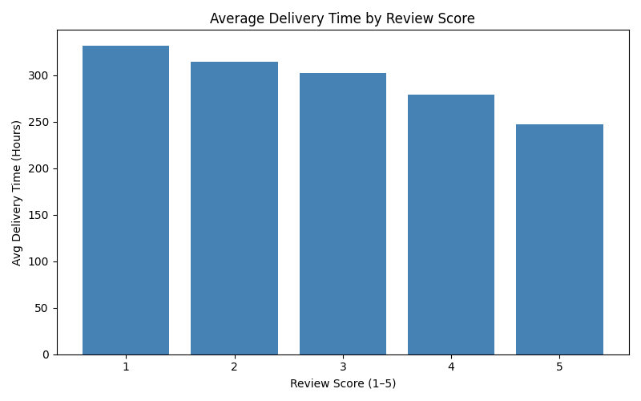
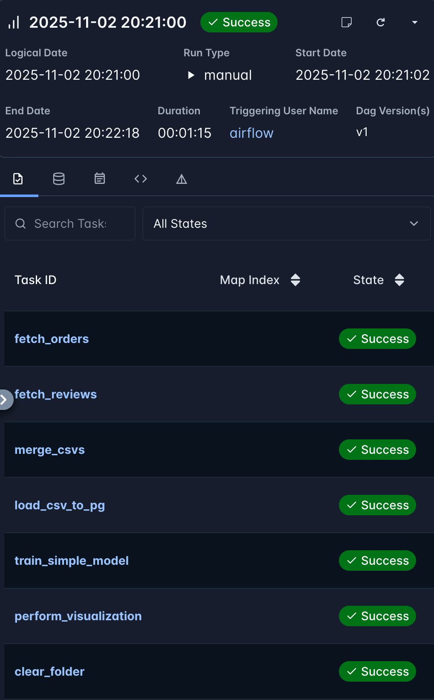
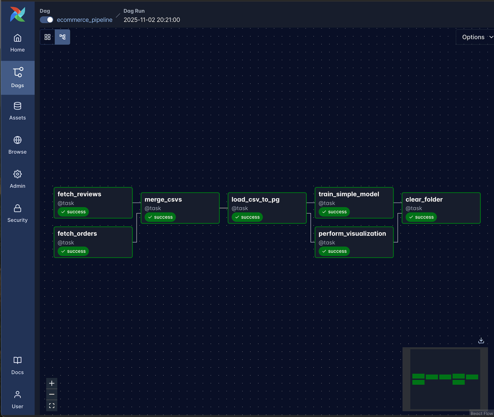

# E-Commerce Data Pipeline Using Apache Airflow

## Project Overview
This project implements an end-to-end data pipeline using **Apache Airflow** that processes e-commerce data from the **Brazilian E-Commerce Public Dataset by Olist**. The pipeline includes data ingestion, transformation, merging, and analysis, culminating in an automated visualization and storage in a PostgreSQL database.

## Dataset Description
The **Brazilian E-Commerce Public Dataset by Olist** consists of over **100,000 orders** made between **2016 and 2018** across various marketplaces in Brazil. This dataset provides a comprehensive view of orders through multiple dimensions such as:

- **Order Status**: Indicates completion state (e.g., delivered, canceled).
- **Price**: The monetary value of each order.
- **Payment and Freight Performance**: Insights into payment methods and shipping details.
- **Customer Location and Product Attributes**: Information about where customers live and details of the products they ordered.
- **Customer Reviews**: Feedback provided by customers after receiving their orders.

The dataset has been anonymized, which makes it suitable for commercial analysis while still providing valuable insights.

## Pipeline Architecture

### DAG Structure
- **DAG ID**: `ecommerce_pipeline`
- **Schedule**: One-time execution (`@once`)
- **Data Flow**: Sequential with parallelizable components

### Data Sources
1. **Orders Dataset**: Contains order transactions and timestamps.
2. **Reviews Dataset**: Contains review scores associated with orders.

## Pipeline Steps

1. **Data Ingestion & Transformation**
   - `fetch_orders`: Loads the orders data, focusing on delivered orders and calculating delivery times. It filters out orders with delivery times exceeding 30 days.
   - `fetch_reviews`: Loads review data and formats it to extract relevant scores.

2. **Data Integration**
   - `merge_csvs`: Merges the orders and reviews datasets based on `order_id`, creating a unified dataset for further analysis.

3. **Database Loading**
   - `load_csv_to_pg`: Loads the resulting merged dataset into a PostgreSQL database table named `assignment.ecommerce_merged`.

4. **Data Analysis & Visualization**
   - **Model Training**:
     - `train_simple_model`: This task trains a **Logistic Regression model** using delivery hours to predict customer satisfaction based on review scores. The dataset is split into training and testing subsets to evaluate performance. The model aims to classify review scores as above or below a threshold (e.g., scores greater than 3).
     - The model achieved an **accuracy of 81%**, as recorded in the Airflow UI logs for the `train_simple_model` task. The model is saved as a `.pkl` file in `/opt/airflow/data/`, allowing for future loading and testing of predictions manually in Python.

   - **Visualization**:
     - `perform_visualization`: Generates a bar plot illustrating the average delivery times categorized by review scores. This visualization helps in understanding how delivery performance affects customer satisfaction. The output is saved as an image file.

### Results and Findings
During the model training process, the resulting **logistic regression model** achieved an accuracy of **81%** in predicting customer satisfaction based on delivery hours. This result indicates that the model is relatively effective in assessing how delivery times influence customer reviews.

To check this metric:
1. Open the Logs for the `train_simple_model` task in the Airflow UI.
2. You’ll find the model accuracy printed in the logs.

The trained model is saved as a `.pkl` file in `/opt/airflow/data/`, which allows you to load it later in Python for manual testing of predictions.

The visualization, which is a bar graph illustrating average delivery times categorized by review scores, is displayed below:

5. **Data Cleanup**
   - `clear_folder`: Cleans up intermediate files generated during the pipeline execution, ensuring that data storage remains organized for subsequent runs.

## Successful DAG Execution

## Technical Implementation

### Key Technologies:
- **Apache Airflow**: Workflow orchestration tool for managing tasks.
- **PostgreSQL**: Data storage for processed results.
- **Pandas**: Data manipulation and analysis toolkit.
- **Matplotlib**: Visualization library for generating plots.
- **Scikit-learn**: Machine learning library for model training.

### Quick Start

#### Prerequisites:
- Docker and Docker Compose installed.
- An Apache Airflow environment set up.
- Access to a PostgreSQL database.

#### Execution:
1. Place source data in `/opt/airflow/data`.
2. Trigger the DAG via Airflow UI or CLI.
3. Monitor execution in Airflow's graph view.
4. Retrieve results from PostgreSQL and access generated visualizations.

## Conclusion

This project demonstrates the feasibility of using Apache Airflow for orchestrating complex data workflows. The e-commerce dataset provided valuable insights into delivery performance and customer satisfaction, with a machine learning component added for predictive analysis. The pipeline architecture ensures efficient data processing, visualization, and storage, making it a robust solution for data-driven decision-making.

## Data Source and Acknowledgements
This dataset was retrieved from a public dataset on Kaggle, linked here: https://www.kaggle.com/datasets/olistbr/brazilian-ecommerce, and this project was completed for IDS 706: Data Engineering with Professor Zhongyuan Yu at Duke University. I referred to this tutorial, created by the class TAs, to complete this: https://sordid-plot-c78.notion.site/Airflow-In-Class-Exercise-28d45dca7a3e80ed9ad8c1636948f103. 